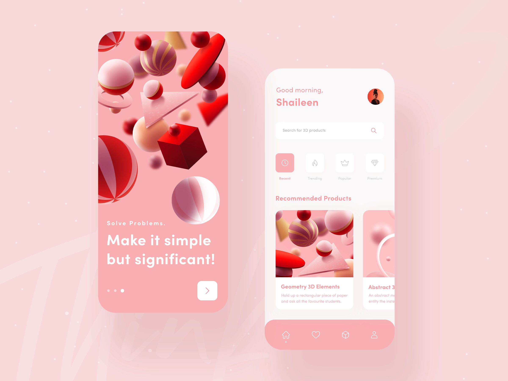

# DribbleChallenge
I am coding a design example from Dribble in SwiftUI.

This is the final result of a Youtube tutorial https://youtu.be/3bsfMNg3I3A

The design is taken from Dribble 
https://dribbble.com/shots/11957539-Mobile-App-UI-Exploration/attachments/3584723?mode=media

The layout is adaptive to adjust for different screen sizes (example: iPhone 8 and iPhone 12 pro)
This is in mostly due to the embedding in a ScrollView

The colors are defined in the assets cataloge and include specific dark mode values.
A higher size category will display the text elements in a larger font size. 

